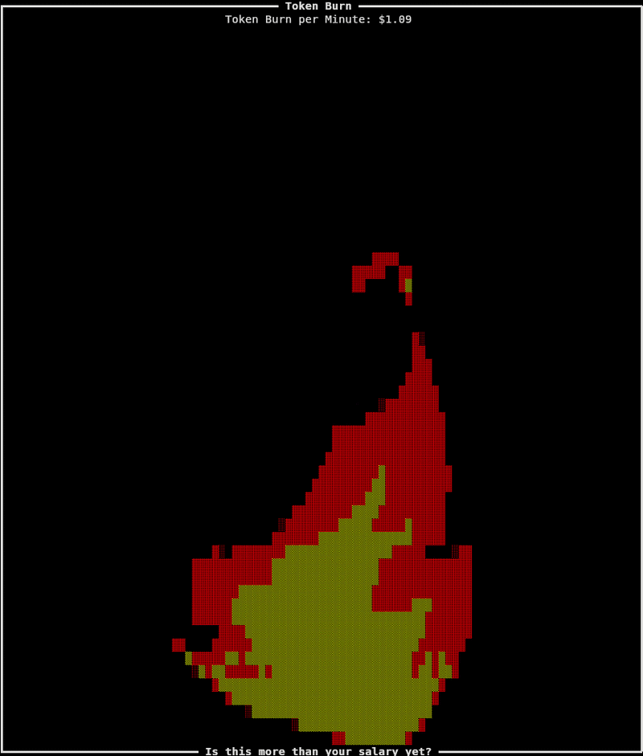

# tokenburn
See how much money you are shovelling on the fire on a minute by minute basis!


(Special thanks to the artist who created the original gif - [I assume Jose Estrada?](https://cdna.artstation.com/p/assets/images/images/034/578/680/original/jose-estrada-firemotionstudy-07.gif))

Tokenburn aims to show just how much money you are burning every time you prompt your model. It allows you to see which operations are costly in real time, as well as providing a little bit of lighthearted fun to the insanity that is the current state of software engineering.

# Installing

## Install latest from source with cargo:

```sh
cargo install --git https://github.com/Magic-JD/tokenburn.git
```

# Running

```sh
tokenburn
```

Yes it really is that simple. This will start token burn running in the current terminal. If you are using claude from any other terminal or tmux pane, it will start to update. Tokenburn will detect any claude tokens spent and will symbolically burn those dollars for you.

# How does this work?

Tokenburn reads your claude logs to detect new entries, extracting the token price from them and calculating the cost. This is then spread over a minute (with a slight ramp up and ramp down) to show your average spend per minute. This cost is cumulative, meaning that the average cost will stack and fluctuate as more logs come in.

# How can I tinker with this?

There are a couple of parameters you can tweak:

```sh
tokenburn --spread 2m
tokenburn --spread m #(will automatically default to 1)
tokenburn --spread 20s
tokenburn --spread 2h --spread 10m --spread s # Equal to two hours, ten minutes and one second
```

Spread will change the length of time in seconds the average cost per minute is calculated for. A shorter time will spike higher and more aggressively. A longer length of time will show lower averages but for a higher number of minutes. A higher number would be ideal if you wanted to see you average for a long running session. A lower number would be good if you wanted to get a really good idea for what some short term operations cost.


```sh
tokenburn --ramp 10
```

Ramp will let you tweak the amount of ramping up and down of the cost that happens. This is calculated as a percentage of the spread time. A 10% ramp with a 60s spread will spend 6s linearly scaling to the average over a minute, 54s showing the average, and then 6s scaling down. Setting it to 0 will disable the ramp, producing an instant jump from one value to the next.

```sh
tokenburn --per 2m
tokenburn --per m #(will automatically default to 1)
tokenburn --per 20s
tokenburn --per 2h --per 10m --per s # Equal to two hours, ten minutes and one second
```
Per will change the cost per timeframe. You could use this to change the cost per minute to the cost per hour.

Most of the time you would probably want the spread and the per to be equal. This makes the most intuitive sense. However there are some use cases where you might not. Say you have a workflow which you intend to run constantly. You could set the cost to per 8h, and then update the spread to 10 minutes. Running that workflow for 10 minutes would then give you a pretty good estimate of how much that workflow will cost per working day.

# I hate the default config!

If you don't like any of the default configurations, and are tired of writing the command with additional arguments, tokenburn supports a user config. You can initialize this by running:

```sh
tokenburn --generate-config
```

This will initialize a copy of the default config into your configurations folder. If you don't like the default config location, setting the env var "TOKENBURN_CONFIG_DIR" will allow you to specify which folder the config should be created in.

